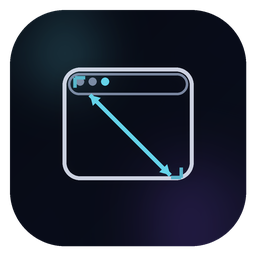

# WindowResizer (WPF) — Fixer une taille de fenêtre partagée pour les présentations & le partage d’écran

<p align="center">
  
</p>

<p align="center">
  <b>Lister les fenêtres ouvertes • En choisir une • Forcer une taille constante (ex. 1280×720 / 1920×1080) • Parfait pour les démos & le partage d’écran</b>
</p>

<p align="center">
  <a href="#why-this-exists">Pourquoi</a> •
  <a href="#features">Fonctionnalités</a> •
  <a href="#how-it-works">Comment ça marche</a> •
  <a href="#getting-started">Démarrage</a> •
  <a href="#build--release">Build & Release</a> •
  <a href="#localization">Localisation</a> •
  <a href="#limitations--notes">Limitations & Notes</a> •
  <a href="#contributing">Contribuer</a> •
  <a href="https://github.com/Jlozde/WindowResizer/releases">Releases</a>
</p>

---

## Traductions

- 🇨🇳 Chinois — [`README.zh-CN.md`](README.zh-CN.md)
- 🇬🇧 Anglais — [`README.md`](README.md)
- 🇫🇷 Français (ce fichier)
- 🇩🇪 Allemand — [`README.de-DE.md`](README.de-DE.md)
- 🇯🇵 Japonais — [`README.ja-JP.md`](README.ja-JP.md)
- 🇰🇷 Coréen — [`README.ko-KR.md`](README.ko-KR.md)
- 🇵🇹 Portugais — [`README.pt-PT.md`](README.pt-PT.md)
- 🇷🇺 Russe — [`README.ru-RU.md`](README.ru-RU.md)
- 🇪🇸 Espagnol — [`README.es-ES.md`](README.es-ES.md)
- 🇹🇷 Turc — [`README.tr-TR.md`](README.tr-TR.md)

> Vous voulez améliorer les traductions ? Les PR sont les bienvenues. Voir [Localisation](#localization).

---

<a id="what-is-windowresizer"></a>

## Qu’est-ce que WindowResizer ?

**WindowResizer** est un outil léger pour Windows (WPF / .NET) qui :

1. **Liste toutes les fenêtres visibles actuellement ouvertes**
2. Vous permet de **sélectionner une fenêtre**
3. Vous permet **d’appliquer une taille cible** (largeur × hauteur) via des préréglages courants (720p / 1080p / 1440p, etc.) ou une taille personnalisée

C’est particulièrement utile si vous :

- faites souvent des **présentations**
- faites du **partage d’écran**
- enregistrez des démos/tutoriels
- streamez ou enseignez en ligne

…car une taille de fenêtre constante rend le rendu plus propre :

- la fenêtre partagée s’aligne mieux dans OBS/Meet/Teams/Zoom
- la mise en page slides + application reste stable
- vos zones de capture n’ont plus besoin d’être ajustées en permanence

> Important : WindowResizer **redimensionne la fenêtre** ; il ne change **pas** la résolution du moniteur.

---

<a id="why-this-exists"></a>

## Pourquoi ce projet existe

Si vous partagez souvent votre écran/fenêtre, vous connaissez déjà la galère :

- la même application n’a jamais exactement la même taille selon les machines
- une zone de capture OBS se décale dès que la fenêtre bouge ou est redimensionnée
- les éléments UI paraissent plus grands/petits selon la taille de fenêtre et le DPI
- “Il suffit de tirer la fenêtre” n’est jamais précis et fait perdre du temps avant chaque démo

Ce projet a été créé pour rendre le workflow **répétable et rapide** :

- choisir la fenêtre
- choisir la taille
- terminé

---

<a id="features"></a>

## Fonctionnalités

### Gestion des fenêtres

- Lister les fenêtres ouvertes (titre + processus + handle)
- Recherche/filtre par titre / processus / handle
- Sélectionner une fenêtre et forcer une taille cible

### Résolutions (tailles de fenêtre)

- Préréglages rapides (tailles “présentation-friendly” populaires)
- Liste complète de tailles courantes
- Ajouter vos propres tailles personnalisées
- Supprimer les tailles personnalisées
- Les tailles personnalisées sont persistées (sauvegardées localement)

### UX / UI

- UI moderne sombre avec barre de titre personnalisée (style Windows 11)
- Mise en page cohérente optimisée pour la sélection + l’action
- Liste de fenêtres pleine largeur, alignée, défilable
- Icône intégrée pour un rendu professionnel dans la barre des tâches

### Localisation

- Packs de langues intégrés (XAML ResourceDictionaries)
- Changement de langue à l’exécution (sans redémarrage)
- Support RTL (arabe) via le basculement de FlowDirection

### Confidentialité par conception

- Pas de télémétrie
- Pas d’analytics
- Aucun appel réseau
- L’app utilise simplement les API Win32 standard pour énumérer et redimensionner des fenêtres

---

<a id="how-it-works"></a>

## Comment ça marche

En interne, WindowResizer s’appuie sur des API Windows standard :

- `EnumWindows` — énumérer les fenêtres de premier niveau
- `IsWindowVisible`, `GetWindowText` — filtrer et récupérer les titres
- `GetWindowThreadProcessId` — associer les fenêtres aux noms de processus
- `GetWindowRect` — lire la taille actuelle de la fenêtre
- `SetWindowPos` — appliquer une nouvelle largeur/hauteur (en option en conservant la position)
- `ShowWindow(SW_RESTORE)` — restaurer si minimisée avant redimensionnement

L’app est DPI-aware (au mieux) pour que les tailles soient plus prévisibles sur les systèmes avec mise à l’échelle.

---

<a id="getting-started"></a>

## Démarrage

### Prérequis

- Windows 10/11
- .NET SDK (recommandé : .NET 8 SDK)
- Visual Studio 2022 (optionnel mais pratique) **ou** build via CLI avec `dotnet`

### Lancer depuis les sources

```powershell
dotnet restore
dotnet run
```

---

<a id="build--release"></a>

## Build & Release

### Build (Release)

```powershell
dotnet clean
dotnet build -c Release
```

Sortie :

```
.\bin\Release\net8.0-windows\
```

### Publish (recommandé)

Crée un dossier distribuable propre.

#### Framework-dependent (plus petit, nécessite le runtime .NET installé)

```powershell
dotnet publish -c Release
```

Sortie :

```
.\bin\Release\net8.0-windows\publish\
```

#### Self-contained (plus gros, pas besoin de .NET)

```powershell
dotnet publish -c Release -r win-x64 --self-contained true
```

Sortie :

```
.\bin\Release\net8.0-windows\win-x64\publish\
```

#### EXE en fichier unique (optionnel)

```powershell
dotnet publish -c Release -r win-x64 --self-contained true `
  -p:PublishSingleFile=true -p:IncludeNativeLibrariesForSelfExtract=true
```

---

<a id="data-storage"></a>

## Stockage des données

WindowResizer stocke de simples préférences locales (ex. langue, résolutions personnalisées) dans votre profil utilisateur (AppData).  
Rien n’est envoyé nulle part.

---

<a id="limitations--notes"></a>

## Limitations & notes

- Certaines fenêtres ne peuvent pas être redimensionnées (elles peuvent bloquer ou ignorer `SetWindowPos`)
- Les apps UWP, les jeux et certaines fenêtres spéciales peuvent se comporter différemment
- Ici, “résolution” signifie **taille de fenêtre** (largeur × hauteur), pas la résolution du moniteur
- Le scaling DPI affecte la taille perçue ; l’app tente d’être DPI-aware, mais le comportement peut varier selon l’application

---

<a id="contributing"></a>

## Pourquoi l’open source compte

Les outils qui interagissent avec d’autres fenêtres doivent être **transparents**.

L’open source signifie :

- tout le monde peut auditer ce que fait l’app
- pas de télémétrie cachée ni de comportement inattendu
- la communauté peut l’améliorer et la maintenir sur le long terme

Ce projet est volontairement petit, lisible, et facile à forker — pour rester utile à celles et ceux qui ont besoin d’une taille de fenêtre stable dans un cadre professionnel.

---

## Licence

Consultez le fichier `LICENSE` pour plus de détails.
