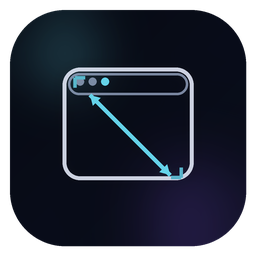

# WindowResizer (WPF) — プレゼン＆画面共有向けの固定ウィンドウサイズツール

<p align="center">
  
</p>

<p align="center">
  <b>開いているウィンドウを一覧 • 1つ選択 • 一定のウィンドウサイズに固定（例：1280×720 / 1920×1080） • 画面共有・デモに最適</b>
</p>

<p align="center">
  <a href="#why-this-exists">なぜ必要か</a> •
  <a href="#features">機能</a> •
  <a href="#how-it-works">仕組み</a> •
  <a href="#getting-started">はじめに</a> •
  <a href="#build--release">ビルド＆リリース</a> •
  <a href="#localization">ローカライズ</a> •
  <a href="#limitations--notes">制限と注意</a> •
  <a href="#contributing">貢献</a>
</p>

---

## 翻訳

- 🇨🇳 中国語 — [`README.zh-CN.md`](README.zh-CN.md)
- 🇬🇧 英語 — [`README.md`](README.md)
- 🇫🇷 フランス語 — [`README.fr-FR.md`](README.fr-FR.md)
- 🇩🇪 ドイツ語 — [`README.de-DE.md`](README.de-DE.md)
- 🇯🇵 日本語（本ファイル）
- 🇰🇷 韓国語 — [`README.ko-KR.md`](README.ko-KR.md)
- 🇵🇹 ポルトガル語 — [`README.pt-PT.md`](README.pt-PT.md)
- 🇷🇺 ロシア語 — [`README.ru-RU.md`](README.ru-RU.md)
- 🇪🇸 スペイン語 — [`README.es-ES.md`](README.es-ES.md)
- 🇹🇷 トルコ語 — [`README.tr-TR.md`](README.tr-TR.md)

> 翻訳改善のPR歓迎です。詳しくは [ローカライズ](#localization) を参照してください。

---

<a id="what-is-windowresizer"></a>

## WindowResizer とは？

**WindowResizer** は軽量な Windows デスクトップツール（WPF / .NET）で、次のことができます：

1. **現在開いている表示中のウィンドウをすべて一覧表示**
2. **対象ウィンドウを選択**
3. 720p / 1080p / 1440p などのプリセット、または任意サイズで **目標サイズ（幅×高さ）を適用**

以下の用途に特に便利です：

- **プレゼン** を頻繁にする
- **画面共有** をよく使う
- デモ/チュートリアルの録画
- 配信やオンライン授業

…一定のウィンドウサイズにすると見た目が整います：

- OBS/Meet/Teams/Zoom で共有ウィンドウがきれいに収まる
- スライド＋共有アプリのレイアウトが安定する
- キャプチャ領域を毎回調整しなくてよい

> 重要：WindowResizer が変更するのは **ウィンドウサイズ** であり、モニター解像度ではありません。

---

<a id="why-this-exists"></a>

## なぜこれが必要か

画面/ウィンドウ共有をよくする人なら、次の悩みはあるはずです：

- 同じアプリでもマシンが変わるとウィンドウサイズが微妙に違う
- OBS のキャプチャ領域が、ウィンドウの移動やリサイズでズレる
- ウィンドウサイズや DPI によって UI の見え方が変わる
- 「ドラッグで揃える」は再現性がなく、毎回時間がかかる

このプロジェクトは、その作業を **再現可能で高速** にするために作られました：

- ウィンドウを選ぶ
- サイズを選ぶ
- 完了

---

<a id="features"></a>

## 機能

### ウィンドウ管理

- 開いているウィンドウを一覧（タイトル + プロセス + ハンドル）
- タイトル / プロセス / ハンドルで検索・フィルタ
- 対象ウィンドウに目標サイズを強制適用

### 解像度（ウィンドウサイズ）

- よく使う“プレゼン向け”サイズのクイックプリセット
- 一般的なサイズの一覧
- カスタムサイズの追加
- カスタムサイズの削除
- カスタムサイズはローカルに保存（永続化）

### UX / UI

- Windows 11 風のカスタムタイトルバー付きモダンなダークUI
- 素早い選択と操作に最適化された一貫したレイアウト
- ウィンドウ一覧は全幅・整列・スクロール対応
- タスクバーで見栄えするアプリアイコン付き

### ローカライズ

- 言語パック内蔵（XAML ResourceDictionaries）
- 実行中に言語切り替え（再起動不要）
- FlowDirection 切り替えによる RTL（アラビア語）対応

### プライバシー重視

- テレメトリなし
- 解析なし
- ネットワーク通信なし
- 標準 Win32 API のみでウィンドウ列挙とリサイズを行います

---

<a id="how-it-works"></a>

## 仕組み

WindowResizer は標準の Windows API を使用しています：

- `EnumWindows` — トップレベルウィンドウを列挙
- `IsWindowVisible`, `GetWindowText` — フィルタとタイトル取得
- `GetWindowThreadProcessId` — ウィンドウをプロセス名に関連付け
- `GetWindowRect` — 現在のサイズ取得
- `SetWindowPos` — 新しい幅/高さを適用（位置保持も可能）
- `ShowWindow(SW_RESTORE)` — 最小化されていれば復元してからリサイズ

DPI の影響を減らすため、可能な範囲で DPI-aware にしています（best-effort）。

---

<a id="getting-started"></a>

## はじめに

### 要件

- Windows 10/11
- .NET SDK（推奨：.NET 8 SDK）
- Visual Studio 2022（任意だが便利）**または** `dotnet` による CLI ビルド

### ソースから実行

```powershell
dotnet restore
dotnet run
```

---

<a id="build--release"></a>

## ビルド＆リリース

### ビルド（Release）

```powershell
dotnet clean
dotnet build -c Release
```

出力：

```
.\bin\Release\net8.0-windows\
```

### 発行（推奨）

配布用のクリーンなフォルダを作成します。

#### フレームワーク依存（小さめ、.NET ランタイムが必要）

```powershell
dotnet publish -c Release
```

出力：

```
.\bin\Release\net8.0-windows\publish\
```

#### 自己完結（大きめ、.NET 不要）

```powershell
dotnet publish -c Release -r win-x64 --self-contained true
```

出力：

```
.\bin\Release\net8.0-windows\win-x64\publish\
```

#### 単一ファイル EXE（任意）

```powershell
dotnet publish -c Release -r win-x64 --self-contained true `
  -p:PublishSingleFile=true -p:IncludeNativeLibrariesForSelfExtract=true
```

---

<a id="data-storage"></a>

## データ保存

WindowResizer は簡単なローカル設定（例：言語、カスタム解像度）をユーザープロファイル（AppData）に保存します。  
どこにも送信しません。

---

<a id="limitations--notes"></a>

## 制限と注意

- ウィンドウによってはリサイズできません（`SetWindowPos` をブロック/無視する場合があります）
- UWP アプリ、ゲーム、特殊なウィンドウは挙動が異なることがあります
- ここでの「解像度」は **ウィンドウサイズ**（幅×高さ）で、モニター解像度ではありません
- DPI スケーリングで見た目のサイズは変わります。可能な限り対応しますが、アプリにより差が出ます

---

<a id="contributing"></a>

## なぜオープンソースが重要か

他のウィンドウを操作するツールは **透明性** が重要です。

オープンソースなら：

- アプリが何をしているか誰でも監査できる
- 隠れたテレメトリや予期しない挙動がない
- コミュニティが長期的に改善・保守できる

本プロジェクトは意図的に小さく、読みやすく、フォークしやすい構成です。安定したウィンドウサイズが必要なプロのワークフローで、長く使えることを目指しています。

---

## ライセンス

他の人がこのプロジェクトをどう利用・再配布できるかを明確にするため、`LICENSE` ファイル（MIT が一般的）を追加してください。
